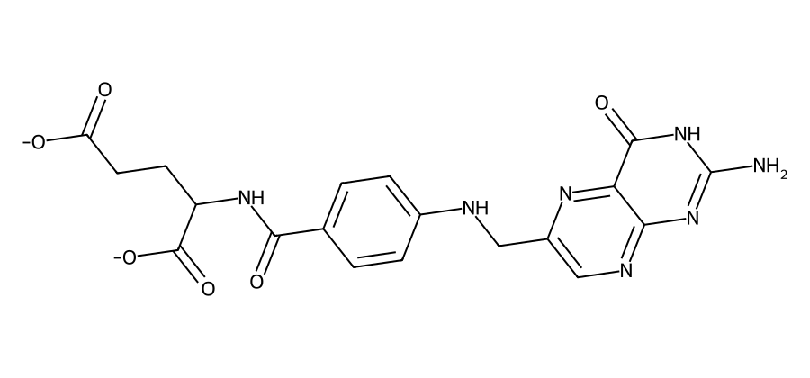
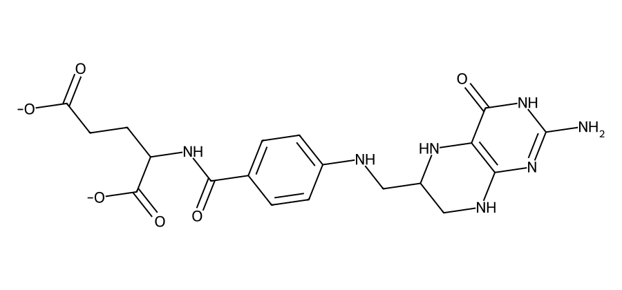
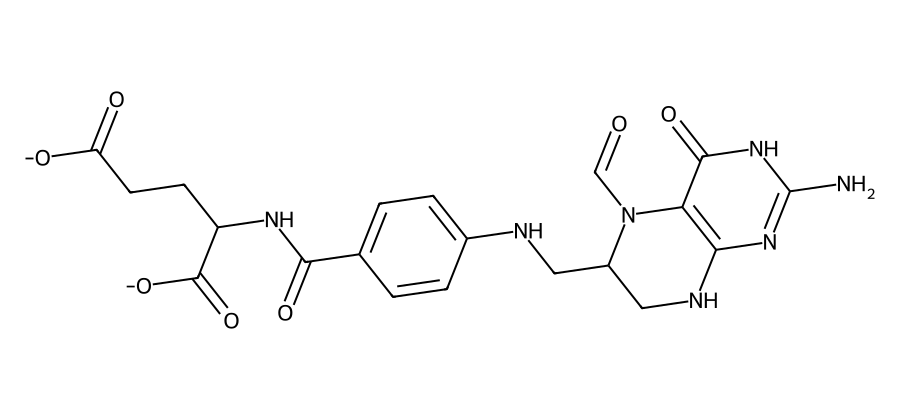
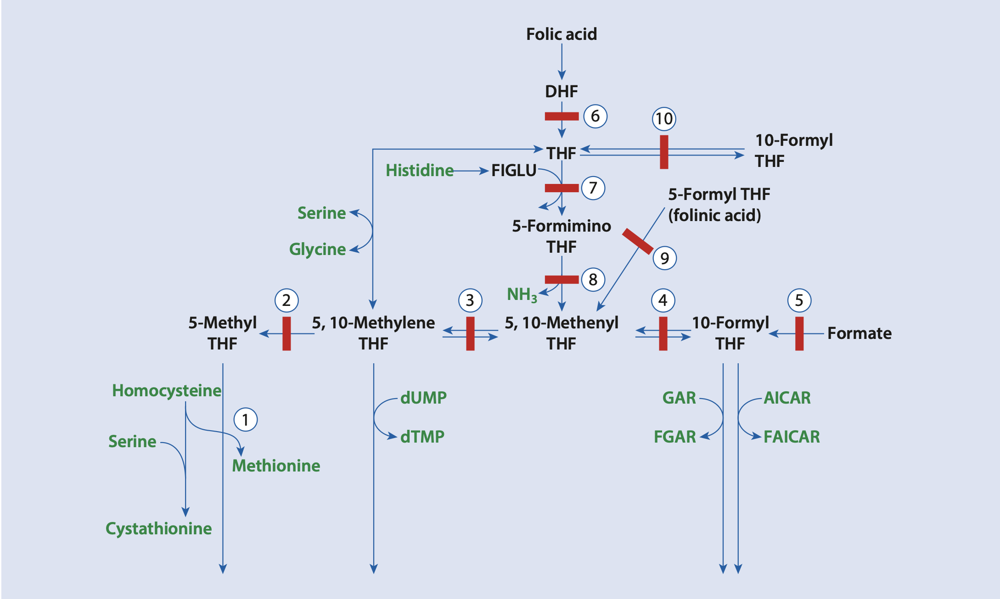
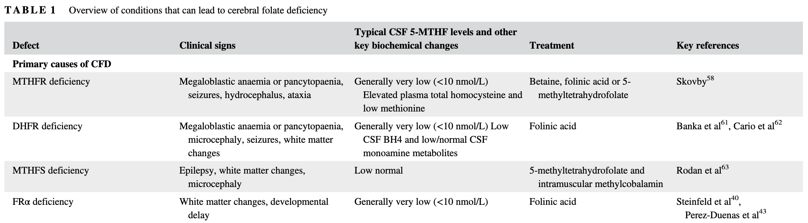

## Disposisjon
- Hva er folat?
- Hvorfor trenger vi folater?
- Opptak av folater
- Omsetning av folater
- Cerebral folatmangel
- Prøvetaking for Sp-MTHF

# Hva er folat?
## Forvirrende folater
::::: {.columns}
:::: {.column width="50%"}

::: {.fragment .highlight-blue fragment-index=7}
*folsyre* ⇌ *folat*
:::

::: {.fragment fragment-index=1}
👨🏻‍🦳 *folinsyre* (hist.)
:::

::::

:::: {.column width="50%"}

::: {.fragment .highlight-blue fragment-index=7}
*folinsyre* ⇌ *folinat*
:::

::: {.fragment fragment-index=1}
👵🏻 *folininsyre* (hist.)
:::
::: {.fragment fragment-index=2}
🇺🇸 *leucovorin* (amer.)
:::

::::
:::::

::: {.fragment fragment-index=3}
De er alle *vitamin B₉*!
:::

::: {.fragment fragment-index=4}
Eller <em>folater</em>, om du vil.
:::

::: {.fragment fragment-index=5}
Eller *folat*, hvis du absolutt insisterer.
:::

::: {.fragment fragment-index=6 style="transition: opacity 4s ease;"}
 
Omfolatelse 🫠
:::

## {.center}
::: {.icon-text}
::: {.icon}
💡
:::
::: {.content}
Folsyre ≠ folinsyre
:::
:::

# Folater
## Folat
{width="70%" fig-align="center"}

## Tetrahydrofolat (THF)
{width="70%" fig-align="center"}

::: {.fragment}
Et *redusert* folat.
:::

## 5-metyltetrahydrofolat (5-MTHF)
{width="70%" fig-align="center"}

::: {.fragment}
Det dominerende folatet i plasma og spinalvæske.
:::

## 5-formyltetrahydrofolat (folinat)
{width="70%" fig-align="center"}

## {.center}
::: {.icon-text}
::: {.icon}
💡
:::
::: {.content}
Biologisk aktive folater er reduserte  
– folsyre er *ikke*.
:::
:::

# Hvorfor trenger vi folater?
## Funksjoner
::: {.incremental}
- Metyleringsreaksjoner (> 100 ulike)
  - DNA-metylering (genregulering)
  - Basisk myelinprotein (MBP)
  - Homocystein → metionin
- Purin- og pyrimidinsyntese
  - DNA-syntese m.m.
:::

# Opptak av folater
## Det er komplisert…
::: {.incremental}
- Samspill mellom (minst) tre ulike transportere
  - Proton-coupled folate transporter (PCFT) 🥬 + 🧠
  - Reduced folate carrier (RFC) 
  - Folate receptor α (FRα) 🧠
:::

## {.center}
::: {.icon-text}
::: {.icon}
💡
:::
::: {.content}
Tarmen tar opp folat via PCFT.  
Hjernen tar opp folat via FRα.
:::
:::

# Omsetning av folater
{width="70%" fig-align="center"}

---

- DHFR, metotreksat og trimetoprim
- MTHFR, ingen anemi
- Folat vs folinat

# Cerebral folatmangel
## Definisjon
- Cerebral folate deficiency (CFD)
- Opprinnelig: Lav Sp-5-MTHF m/normal perifer folatstatus
- Løsere bruk: Lav Sp-5-MTHF uavhengig av øvrig folatstatus

## Symptomer
:::: {.columns}

::: {.column .incremental width="50%"}

### Systemisk mangel
- Megaloblastisk anemi
- Munnsår

:::

::: {.column .incremental width="50%"}

### Cerebral mangel
- Utviklingsforsinkelse eller tap av ferdigheter
- Epilepsi
- Ataksi, dystoni eller spastisitet
- Noen får også autistiske trekk eller irritabilitet

:::

::::

## Primære CFD {.smaller}
| Sykdom | Klinikk | Biokjemi | Behandling |
|--------|---------|----------|------------|
| MTHFR-mangel | Apné, **epilepsi**, **mikrocefali**, hypotoni, ataksi | ↓ Sp-5-MTHF   ↓/n P-Folat   ↑ P-Hcy, ↓ P-Met | Folinsyre/5-MTHF + betain |
| DHFR-mangel | Megaloblastisk anaemi, **mikrocefali**, **epilepsi** | ↓ Sp-5-MTHF   n P-Folat  n P-Hcy | Folinsyre |
| MTHFS-mangel | **Epilepsi**, hypotoni, **mikrocefali** | (↓) Sp-5-MTHF | 5-MTHF + Me-kobalamin   ⚠️ *Ikke* folinsyre |
| FRα-mangel | Forsinket (motorisk) utvikling, spastisk paraplegi, ataksi, myoklon **epilepsi**, **autistiske trekk** | ↓ Sp-5-MTHF | Folinsyre   ⚠️ *Ikke* folsyre |

{width="70%" fig-align="center"}

## {.center}
::: {.icon-text}
::: {.icon}
💡
:::
::: {.content}
Folsyre ≠ folinsyre
:::
:::

## Sekundære årsaker
- Medikamenter
  - Langvarig levodopa-karbidopa
  - Fenytoin, karbamazepin, barbiturater, valproat (særlig poeng for CFD-pasienter med epilepsi)
  - Metotreksat og trimetoprim (DHFR)
- Mitokondriesykdommer og enkelte andre IMD
- Autoantistoffer mot FRα

## Autoantistoffer mot FRα
