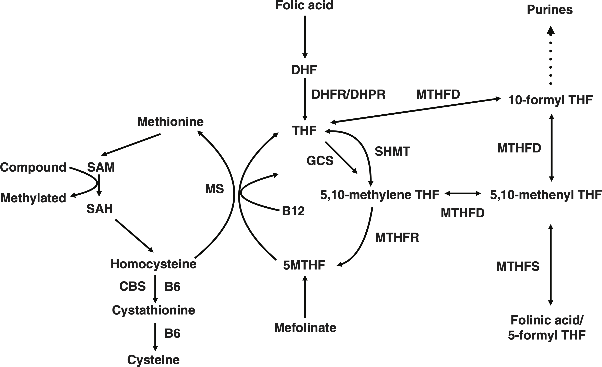

## Disposisjon
- Hva er folat?
- Hvorfor trenger vi folater?
- Transport og omsetning av folater
- Cerebral folatmangel (CFD)
- Autisme og CFD
- Prøvetaking

# Hva er folat?
## Forvirrende folater
::::: {.columns}
:::: {.column width="50%"}

::: {.fragment .highlight-blue fragment-index=7}
*folsyre* ⇌ *folat*
:::

::: {.fragment fragment-index=1}
*folinsyre* (hist.)
:::

::::

:::: {.column width="50%"}

::: {.fragment .highlight-blue fragment-index=7}
*folinsyre* ⇌ *folinat*
:::

::: {.fragment fragment-index=1}
*folininsyre* (hist.)
:::
::: {.fragment fragment-index=2}
*leucovorin* (amer.)
:::

::::
:::::

::: {.fragment fragment-index=3}
De er alle *vitamin B₉*!
:::

::: {.fragment fragment-index=4}
Eller <em>folater</em>, om du vil.
:::

::: {.fragment fragment-index=5}
Eller *folat*, hvis du absolutt insisterer.
:::

::: {.fragment fragment-index=6 style="transition: opacity 2s ease;"}
 
Omfolatelse…
:::

## {.center}
::: {.icon-text}
::: {.icon}
💡
:::
::: {.content}
Folsyre ≠ folinsyre
:::
:::

# Folater

## Folat {.nostretch}

{width="70%" fig-align="left"}

## Tetrahydrofolat (THF) {.nostretch}

{width="70%" fig-align="left"}

::: {.fragment}
Et *redusert* folat.
:::

## 5-metyltetrahydrofolat (5-MTHF) {.nostretch}

{width="70%" fig-align="left"}

::: {.fragment}
Det dominerende folatet i plasma og spinalvæske.
:::

## 5-formyltetrahydrofolat (folinat) {.nostretch}
{width="70%" fig-align="left"}

## {.center}
::: {.icon-text}
::: {.icon}
💡
:::
::: {.content}
Biologisk aktive folater er reduserte – folsyre er *ikke*
:::
:::

# Hvorfor trenger vi folater?
## Funksjoner
::: {.incremental}
- Metyleringsreaksjoner (> 100 ulike)
  - DNA-metylering (genregulering)
  - Basisk myelinprotein (MBP)
  - Homocystein → metionin
- Purin- og pyrimidinsyntese
  - DNA-syntese m.m.
:::

# Transport av folater
## Det er komplisert…
::: {.incremental}
- Samspill mellom (minst) fire ulike transportere
  - Proton-coupled folate transporter (PCFT)
  - Reduced folate carrier (RFC) 
  - Folate receptor α (FRα)
  - Folate receptor β (FRβ)
:::

## {.center}
::: {.icon-text}
::: {.icon}
💡
:::
::: {.content}
Cerebralt opptak av *ikke-reduserte* folater trenger FRα
:::
:::

# Omsetning av folater

## Folatmetabolismen {#folmet .smaller}
:::: {.columns}

::: {.column .incremental width="40%"}
- **DHFR** «aktiverer» folsyre
  - Kjent fra metotreksat, trimetoprim
- **MTHFS** «aktiverer» folinsyre
- **MTHFR** danner 5-MTHF
  - 5-MTHF → metyleringsreaksjoner
  - 5,10-metylen-THF → pyrimidiner
  - 10-formyl-THF → puriner
:::

::: {.column width="60%"}
{width="100%"}
:::
::::

# Cerebral folatmangel
## Definisjon
- Cerebral folate deficiency (CFD)
- Opprinnelig: ↓ Sp-5-MTHF + normal perifer folatstatus
- Løsere bruk: ↓ Sp-5-MTHF (uavhengig av øvrig folatstatus)

## Symptomer og funn {#symp}
:::: {.columns}

::: {.column .incremental width="50%"}

### Systemisk mangel
- Megaloblastisk anemi
- Munnsår

:::

::: {.column .incremental width="50%"}

### Cerebral mangel
- Mikrocefali
- Forsinket utvikling, tap av ferdigheter
- Epilepsi
- Ataksi, dystoni eller spastisitet
- Autistiske trekk eller irritabilitet
- Forsinket myelinisering (MR-funn)

:::

::::

## Primær CFD {.smaller}
| Sykdom | Klinikk | Biokjemi | Behandling |
|--------|---------|----------|------------|
| MTHFR-mangel | Apné, **epilepsi**, **mikrocefali**, hypotoni, ataksi | ↓ Sp-5-MTHF   ↓–n P-Folat   ↑ P-Hcy, ↓ P-Met | 5-MTHF/folinsyre + betain + metionin + B12 |
| DHFR-mangel | Megaloblastisk anemi, **mikrocefali**, **epilepsi** | ↓ Sp-5-MTHF   n P-Folat | Folinsyre |
| MTHFS-mangel | **Epilepsi**, hypotoni, **mikrocefali** | (↓) Sp-5-MTHF | 5-MTHF + Me-kobalamin   ⚠️ *Ikke* folinsyre |
| FRα-mangel | Forsinket (motorisk) utvikling, spastisk paraplegi, ataksi, myoklon **epilepsi**, **autistiske trekk** | ↓ Sp-5-MTHF | Folinsyre   ⚠️ *Ikke* folsyre |

[⬅ Metabolismen](#folmet)

## {.center}
::: {.icon-text}
::: {.icon}
💡
:::
::: {.content}
Folsyre ≠ folinsyre  
(folinsyre kan bruke RFC)
:::
:::

## MTHFR
::: {.incremental}
- MTHFR-*mangel* er vanligste IMD i folatmetabolismen (\> 200 pasienter)
- MTHFR-*polymorfismer* er vanlige i befolkningen
  - c.665C>T (C677T) assosiert med ↑ Hcy i heterozygoti
  - c.1286A>C (A1298C) assosiert med ↑ Hcy i homozygoti
  - Hver av disse har ~11–13,5 % homozygote europeere
- Genotyper med ↑ Hcy kalles tidvis 'mangel' uavhengig av grad
  - Bør da skille mellom alvorlig og lett mangel
:::

## Sekundær CFD
- Systemisk folatmangel: diett, tarmsykdom
  - ⚠️ MTHFR-polymorfisme
- Medikamenter
  - Langvarig levodopa-karbidopa
  - Antiepileptika (fenytoin, karbamazepin, valproat ++)
    - ⚠️ CFD-pasienter med epilepsi
  - Metotreksat og trimetoprim (DHFR)
- Mitokondriesykdommer og andre IMD (f.eks. serinsyntesedefekter)
- Autoantistoffer mot FRα

# FRα-autoantistoffer (FRAA)
## FRAA og CFD
- Ramaekers VT, N Blau. Develop Med Child Neuro. (2004): Idiopatisk cerebral folatmangel
  - ↓ Sp-5-MTHF, normal sekvensering av *FOLR1* (FRα)
- Ramaekers VT et al. NEJM (2005): Autoantistoffer ved idiopatisk CFD
  - 28 barn m/CFD, 28 friske kontroller, 41 pasienter m/annen nevrologisk sydom
  - Blokkerende FRα-antistoffer (FRAA) i 25/28 av CFD-pasienter, ingen av de andre
  
## FRAA og vanlige folks tur
- Første studier hadde CFD som inklusjonskriterium
  - ↓ Sp-5-MTHF og flere klassiske (alvorlige) [symptomer](#symp)
- Senere målt FRAA i en rekke tilstander
  - Schizofreni, depresjon, ADHD, autisme ++
  
# Autisme og CFD

---

{width="10%" fig-align="center"}

## Hva sier evidensen?
:::: {.columns}
::: {.column}
### På den ene side
::: {.smaller}
- FRAA hos 50–70 % av pasienter med ASD
- FRAA negativt korrelert med Sp-5-MTHF
- Lavere perinatalt folattilskudd forbundet med ASD
- MTHFR c.665C>T (C677T): økt effekt av perinatalt folat, økt effekt av folinsyre ved autisme
- RCT har vist effekt av folinsyre
:::
:::

::: {.column .fragment}
### På den annen side
::: {.smaller}
- FRAA påvist i mange tilstander og fluktuerer
  - Det er Sp-5-MTHF også, uten klar sammenheng med symptombyrde
- *Høyere* perinatalt folattilskudd forbundet med ASD
- Studien m/økt effekt av folinsyre ved c.665C>T undersøkte mye, fant lite
- Største RCT-en (av 3–4) trukket tilbake (fant ikke effekt ved reanalyse)
- FRAA → CFD → autisme, schizofreni ++ er kun påvist av én gruppe forskere
:::
:::
::::

## {.center}
::: {.icon-text}
::: {.icon}
💡
:::
::: {.content}
FRAA og CFD kan være epifenomener ved nevrologisk sykdom, inkl. autisme
:::
:::

## Amerikanske fagmiljøer {.smaller}
:::: {.columns}
::: {.column}
- **American Academy of Pediatrics (APA)**
  - Ikke evidens for folinsyre uten CFD
  - Hvis mulig CFD, vurdér Sp-5-MTHF eller genetikk (*ikke* MTHFR-polymorfismer)
  - Ikke legg for mye vekt på FRAA
- **Society for Inherited Metabolic Disorders (SIMD)**
  - Diagnostisk testing av *alle* med ASD for å avgjøre behandling
  - Spesifiserer ikke testene, men viser til «tradisjonell» ressurs
:::
::: {.column}
- **Food and Drug Administration (FDA)**
  - Indikasjonen gjelder CFD
  - Flere studier trengs før godkjenning for CFD med FRAA
:::
::::

## FRAA i Norge
- Lab1 AS eneste tilbyder
  - Gir ikke eksplisitte indikasjoner
    - Nevner CFD, ASD, schizofreni, depresjon og nevralrørsdefekter
  - «kan ikke benyttes til å stille diagnose»
  - 5 950 kr

# Prøvetaking

## Indikasjoner for Sp-5-MTHF
  - Suspekte [symptomer eller funn](#symp) bør senke terskel for spinalpunksjon
    - Forsinket utvikling + epilepsi og negativ øvrig utredning → vurdere nevrotransmittere generelt
  - Skal man uansett spinalpunktere, ta med en boks med tørris
    
## Prøvetaking for Sp-5-MTHF
- 0,5 mL (= 10 dråper) spinalvæske
- Glass uten tilsetning
- Unngå blødning (unngå fraksjon 1)
  - Hvis blod: sentrifuger umiddelbart, overfør klar væske til nytt glass
- Skriv på prøvetidspunkt og fraksjonsnummer
- Sett umiddelbart på tørris
- Send frosset, notér ev. stikkblødning på rekvisisjonen

## {.center}
::: {.icon-text}
::: {.icon}
⚠️
:::
::: {.content}
Ved fullt nevrotransmitterpanel blir det mer komplisert, se [ous.labfag.no](http://ous.labfag.no)
:::
:::

## Prøvetaking for full pakke
{width="50%" fig-align="right"}

# Behandling ved MTHFR-polymorfismer
## Etter Kiarash Tazmini
- Folsyre 1–2 mg × 1
  - Noen klarer seg med økt folat i kosten
- P-Folat må ofte \> 45 nmol/L (RI \> 7 nmol/L)
- Kontroll P-Homocystein (Hcy) ca. hver 3. måned
  - Normalisert Hcy → fastlege for årlige kontroller: folat, Hcy, kreatinin (Hb, B12, MMA)
